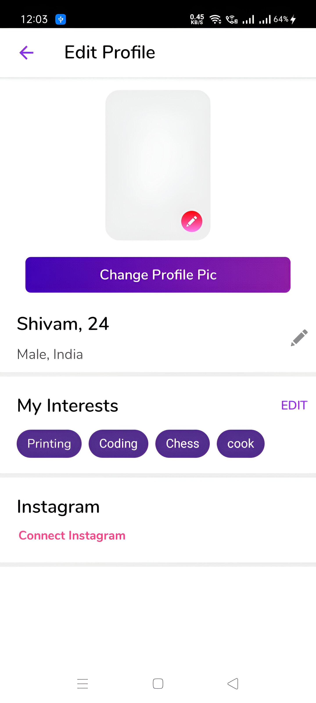

# 💘 Luv.ly – Native Android Dating App (Firebase-integrated)

**Luv.ly** is a polished, native Android dating app prototype built in **Kotlin**. It walks users through a complete dating app experience — from phone authentication and profile creation to browsing matches — all powered by Firebase.

This is a functional UI+logic project with **Firebase OTP Auth**, **Cloud Firestore**, **Firebase Storage**, **ExoPlayer**, and more.

---

## ✨ Features

- 📲 Firebase Phone OTP Authentication
- 👤 Multi-step profile onboarding with image upload
- ☁️ Cloud Firestore to store user profiles
- 🖼️ Firebase Storage for media
- 📹 Video playback using ExoPlayer
- 🎨 Responsive, modern Android UI with ConstraintLayout
- 🎯 Coroutines for async tasks
- 🌗 Light/Dark design-ready

---

## 🖼️ Screenshots

<div align="center">
  <table>
    <tr>
      <td></td>
      <td></td>
      <td></td>
      <td></td>
    </tr>
    <tr>
      <td></td>
      <td></td>
      <td></td>
      <td></td>
    </tr>
    <tr>
      <td></td>
      <td></td>
      <td></td>
      <td></td>
    </tr>
  </table>
</div>

---

## 🔧 Tech Stack & Dependencies

- **Language:** Kotlin
- **UI:** ConstraintLayout, CircularImageView, Lottie, RangeSeekBar
- **Firebase:**
  - `firebase-auth-ktx` (OTP login)
  - `firebase-firestore-ktx` (user data)
  - `firebase-storage-ktx` (media)
  - `firebase-analytics`, `messaging`, `crashlytics`
- **Media:** ExoPlayer
- **Architecture:** Navigation Component + Modular structure
- **Async:** Kotlin Coroutines + Coroutine support for Firebase
- **Other Libraries:**
  - Glide (image loading)
  - Retrofit + OkHttp (networking base, expandable)
  - Chip Navigation Bar
  - PinView (for OTP input)
  - Card Stack View (Tinder-like swiping)

---

## 📁 Sample `build.gradle` Dependencies

<details>
<summary>Click to expand full list</summary>

```kotlin
implementation platform('com.google.firebase:firebase-bom:28.2.1')
implementation 'com.google.firebase:firebase-auth-ktx'
implementation 'com.google.firebase:firebase-storage-ktx'
implementation 'com.google.firebase:firebase-firestore-ktx'
implementation 'com.google.firebase:firebase-analytics-ktx'
implementation 'com.google.firebase:firebase-messaging-ktx'
implementation 'com.google.firebase:firebase-crashlytics-ktx'
implementation 'com.firebaseui:firebase-ui-storage:7.2.0'

// ExoPlayer
implementation 'androidx.media3:media3-exoplayer:1.0.0'
implementation 'androidx.media3:media3-ui:1.0.0'

// Image & UI
implementation 'com.github.bumptech.glide:glide:4.12.0'
annotationProcessor 'com.github.bumptech.glide:compiler:4.12.0'
implementation 'com.github.abdularis:circularimageview:1.5'
implementation 'com.airbnb.android:lottie:3.4.0'
implementation 'com.intuit.sdp:sdp-android:1.0.5'
implementation 'com.yuyakaido.android:card-stack-view:2.3.4'
implementation 'com.chaos.view:pinview:1.4.4'

// Navigation
implementation 'androidx.navigation:navigation-fragment-ktx:2.3.5'
implementation 'androidx.navigation:navigation-ui-ktx:2.3.5'

// Network
implementation 'com.squareup.retrofit2:retrofit:2.8.0'
implementation 'com.squareup.retrofit2:converter-gson:2.8.0'
implementation 'com.squareup.okhttp3:logging-interceptor:4.2.1'

// Coroutines
implementation 'org.jetbrains.kotlinx:kotlinx-coroutines-core:1.3.9'
implementation 'org.jetbrains.kotlinx:kotlinx-coroutines-android:1.3.9'
implementation 'org.jetbrains.kotlinx:kotlinx-coroutines-play-services:1.1.1'
